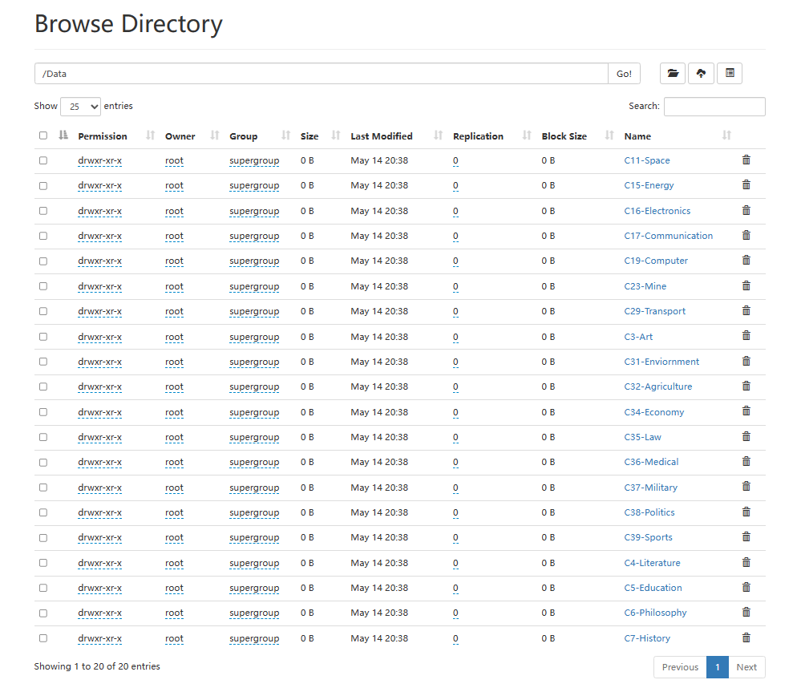

# 数据预处理与上传

## 原数据下载

https://www.kaggle.com/datasets/louislung/categorised-news-dataset-from-fudan-university

使用数据集中的/fudan_news/fudan/train下的数据

## 数据预处理

将每个分类文件夹下的所有语料过滤除汉字、标点的所有字符，并整合到一个txt文件中，为每个类别创建一个txt文件。

### 数据简单清洗

```python
for p in paths:
    print('start treat: ',p)
    file_path = os.path.join(cur_path,p,'utf8')
    filenames = os.listdir(file_path)
    result= []
    for filename in filenames:
        with open(os.path.join(file_path,filename)) as file:
            lines = file.readlines()
            text = ''
            for line in lines:
                line = line.replace(' ','')
                line = line.replace('\t','')
                line = line.replace('\n','')
                line = line=re.sub('[^(\u4e00-\u9fa5\u3002\uff1b\uff0c\uff1a\u201c\u201d\uff08\uff09\u3001\uff1f\u300a\u300b)]+','',line)
                if re.match('【.*】',line) or len(line)<5:
                    continue
                # seg = jieba.cut(line)
                # reslst = []
                # for item in seg:
                #     if item not in stopwords:
                #         reslst.append(item)
                # text = text + ' '.join(reslst)
                text = text + line
            result.append(text)

    key = p.split('-')[1]

    if not os.path.exists('./Data'):
        os.mkdir('./Data')
    if not os.path.exists(os.path.join('./Data',p)):
        os.mkdir(os.path.join('./Data',p))
    with open(os.path.join('./Data',p,key+'.txt'),'w') as file:
        for idx,line in enumerate(result):
            if idx !=0:
                file.write('\n')
            file.write(line)
```

过滤数据中的空格、制表符、回车、数字、字母等符号，只保留汉字和标点符号，将同一个类型的新闻语料保存在同一个txt文件中，每个新闻占为一行。

### 本机分词

在数据量较少的情况下，分词工作也可以在本机进行，使用python的jieba库进行分词

使用 中文停用词表(https://github.com/goto456/stopwords/blob/master/cn_stopwords.txt) 过滤停用词

```python
# 分词版本
for p in paths:
    print('start treat: ',p)
    file_path = os.path.join(cur_path,p,'utf8')
    filenames = os.listdir(file_path)
    result= []
    for filename in filenames:
        with open(os.path.join(file_path,filename)) as file:
            lines = file.readlines()
            text = ''
            for line in lines:
                line = line.replace(' ','')
                line = line.replace('\t','')
                line = line.replace('\n','')
                line = line=re.sub('[^(\u4e00-\u9fa5\u3002\uff1b\uff0c\uff1a\u201c\u201d\uff08\uff09\u3001\uff1f\u300a\u300b)]+','',line)
                if re.match('【.*】',line) or len(line)<5:
                    continue
                seg = jieba.cut(line)
                reslst = []
                for item in seg:
                    if item not in stopwords:
                        reslst.append(item)
                text = text + ' '.join(reslst)
            result.append(text)
    key = p.split('-')[1]

    if not os.path.exists('./Data_splited'):
        os.mkdir('./Data_splited')
    if not os.path.exists(os.path.join('./Data_splited',p)):
        os.mkdir(os.path.join('./Data_splited',p))
    with open(os.path.join('./Data_splited',p,key+'.txt'),'w') as file:
        for idx,line in enumerate(result):
            if idx !=0:
                file.write('\n')
            file.write(line)
```

在简单清洗的基础上增加分词和过滤停用词操作，与简单清洗的输出格式相同，将同一个类型的新闻语料保存在同一个txt文件中，每个新闻占为一行。

# 上传数据

从服务器上传至容器内

```shell
[root@hecs-161794 datasets]# docker cp ./Data 27ba7059e920:/root/
Successfully copied 259MB to 27ba7059e920:/root/
```

从容器上传至HDFS

```shell
root@27ba7059e920:~# hdfs dfs -put ./Data /
```



上传成功