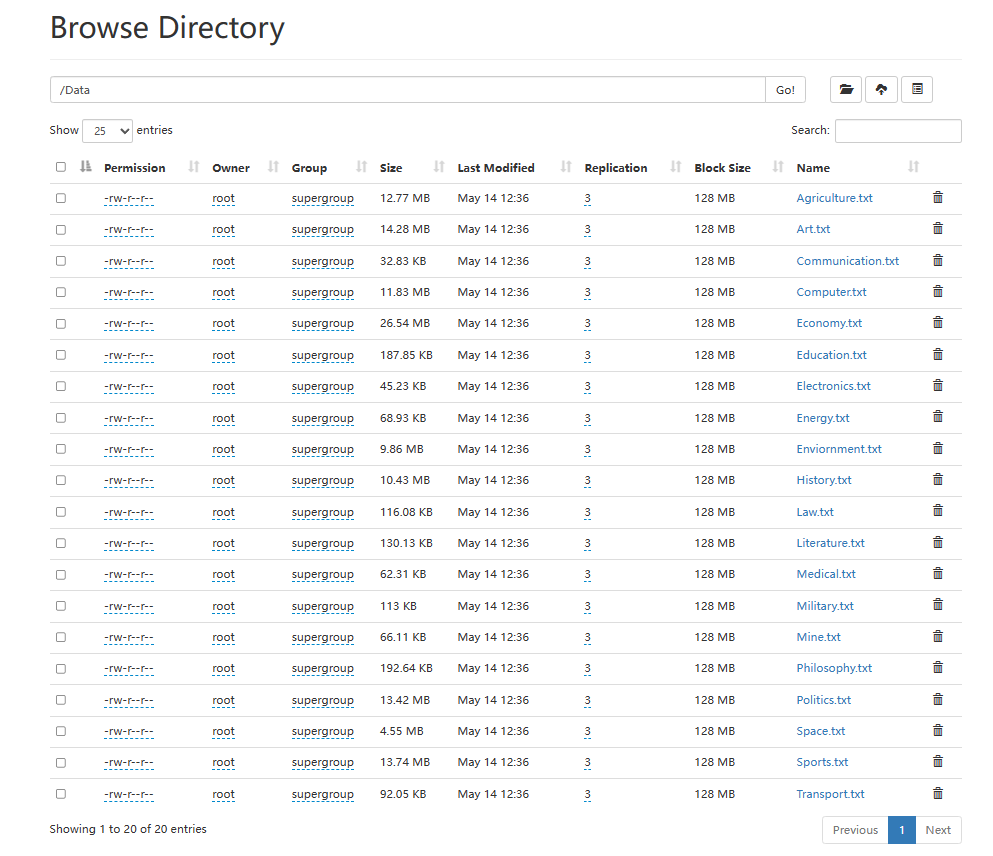

# 数据预处理与上传

## 原数据下载

https://www.kaggle.com/datasets/louislung/categorised-news-dataset-from-fudan-university

使用数据集中的/fudan_news/fudan/train下的数据

## 数据预处理

将每个分类文件夹下的所有语料过滤除汉字、标点的所有字符，并整合到一个txt文件中，为每个类别创建一个txt文件。

# 上传数据

从服务器上传至容器内

```shell
[root@hecs-161794 datasets]# docker cp ./Data 27ba7059e920:/root/
Successfully copied 259MB to 27ba7059e920:/root/
```

从容器上传至HDFS

```shell
root@27ba7059e920:~# hdfs dfs -put ./Data /
```



上传成功